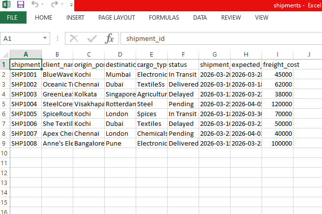

## Project:
Shipment MIS Automation using Python

## Description:
This project automates shipment data analysis by reading CSV input, processing key metrics like delivery status and delays, and generating a structured Excel MIS report.

## Features:
-Reads shipment data from CSV
-Analyzes status (Delivered, Pending, Delayed)
-Calculates total freight revenue
-Identifies overdue shipments
-Generates formatted Excel report

## Technologies Used:
-Python
-pandas
-openpyxl

## Input Format:
shipment_id, client_name, origin_port, destination_port, cargo_type, status, shipment_date, expected_delivery, freight_cost

## Output:
Generates an Excel file with
-Full shipment data
-MIS summary report

## Screenshots:

